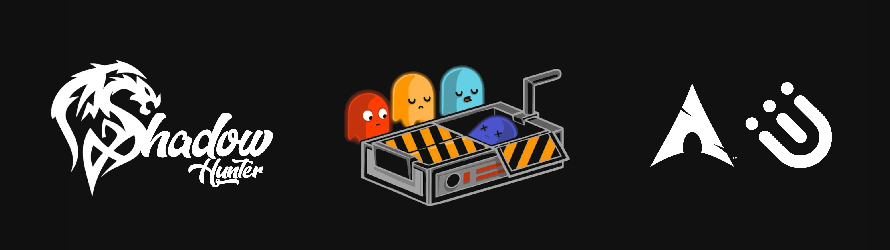
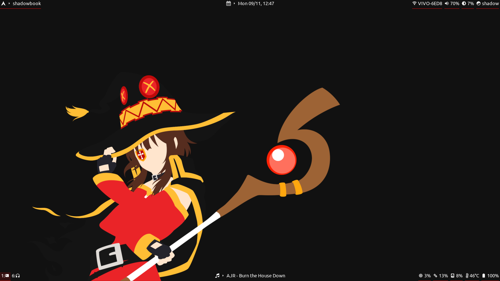
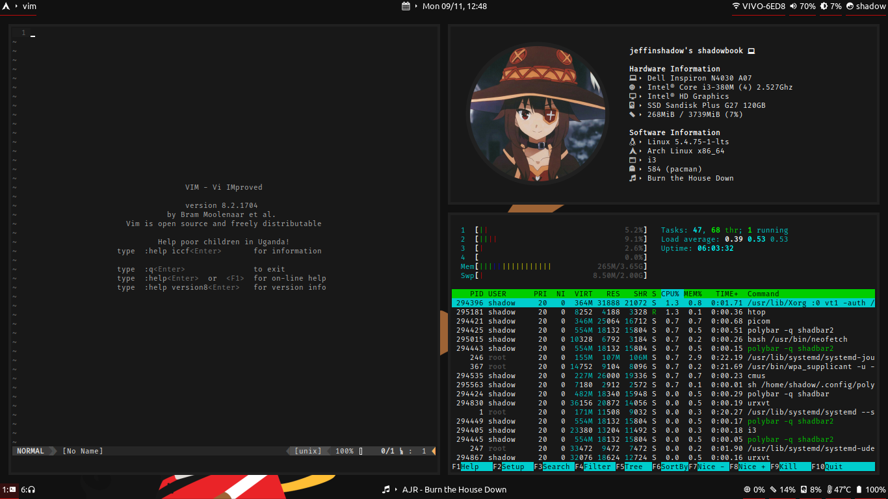
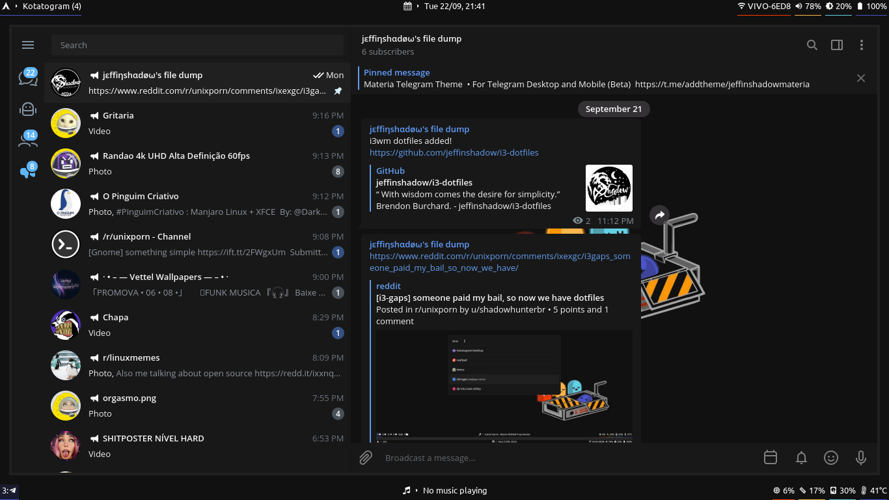

# Welcome to my minimalist but elegant i3wm setup!
###### "With wisdom comes the desire for simplicity.” - Brendon Burchard.

     

# Main Software

### [i3-wm](src=".config/i3/") + [polybar](src=".config/polybar/")

### [rofi](src=".config/rofi/")

### [URxvt](src=".Xresources")

# Shadow-Materia Themes

### [Shadow-Materia GTK Theme](src=".themes/")

### [Shadow-Materia Telegram Theme](https://t.me/addtheme/shadowmateria)

### [Shadow-Materia Chrome Theme](src=".chrome-themes/")

# Other Themes

### [GIMP Interface Layout](src=".config/GIMP/")

### [CMUS Theme](src=".config/cmus/")

### Used utilities:
| Types            | Programs      |
| :--------------- | :------------ |   
| Browser          | chromium      |
| Composer	   | xcompmgr      |
| File Explorer    | nemo          |                                            
| GTK theme setter | lxappearance  |
| Image viewer     | viewnior      |                                                                                         
| Print Screen     | scrot         |                                            
| Shell            | zsh           |                                                                           
| Text editor      | vim, leafpad  |                                                                             
| Wallpaper setter | nitrogen      |

### You can download the wallpaper used in the configuration [here](src="Wallpapers").
